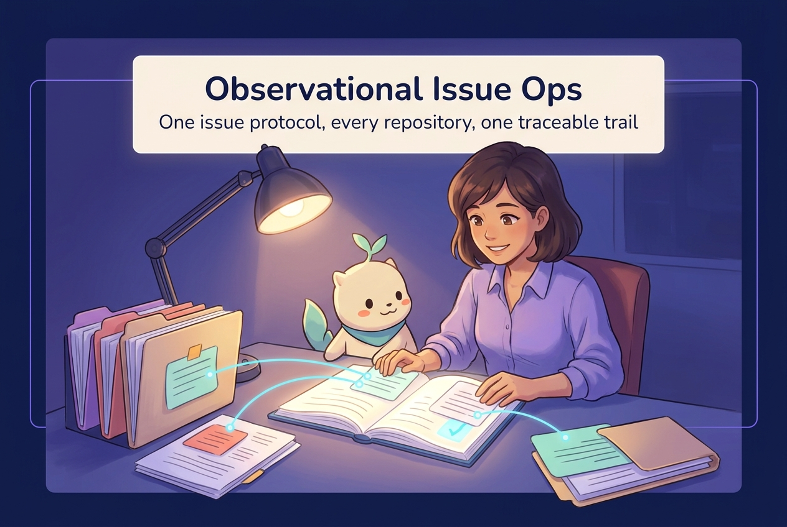

# Observational Issue Ops

> **One shared way to report what you saw.** A three-plane, non-binding observational issue protocol, so a report filed on any repository keeps its provenance and lands on one traceable trail.

  

A multi-repository project can hold strong evidence and still lose the report. When each repository keeps its own issue form and its own copy of the rules, the same observation gets written down differently in every place, and a reader cannot tell which copy is authoritative.

Observational Issue Ops (OIO) is the one source for that protocol. It gives a maintainer or an agent a single, repeatable way to file an observation, rate it, and follow it from first sighting to a decision.

## Why this exists

**Copied rules drift.** The same issue form, the same triage, and the same version pins get hand-copied into several repositories. Nothing forces the copies to agree, so they quietly diverge. A person following one repository's own guidance can end up describing the stack differently from a person following another's.

  

The cost is not only tidiness. When a version pin drifts, an adopter can install a stack that no longer matches what the repository claims, and no check catches it. When the issue form drifts, two reports of the same problem cannot be compared. OIO removes the copy: the rule lives in one place, and every repository points at it.

## What this project is

OIO is a small governance repository. It is for the owner who rates proposals, for collaborators and agents who file them, and for anyone who needs one understandable way to report what they saw.

It provides:

- **one issue form** — a three-plane observational template that asks for provenance, reproducibility, citations, and a priority rating;
- **one triage step** — automation that reads a filed issue and applies the matching plane and priority labels;
- **one place to point** — every other repository consumes this source instead of keeping its own copy.

It is **not** a tracker, a workflow engine, or a place to store another project's issues. Each repository keeps its own issue history.

## What you can make or use

| You want to | OIO gives you | Where it lives |
| --- | --- | --- |
| File an observation the same way everywhere | The three-plane issue form | `.github/ISSUE_TEMPLATE/observational-issue.yml` |
| Have a filed issue labelled by plane and priority | The triage workflow | `.github/workflows/issue-triage.yml` |
| Understand the protocol before filing | The template's own field descriptions | the issue form itself |
| Point another repository at one source | A single repository to reference | this repository |

## How it works

Every report moves along the same short path, and the plane the reporter chooses sets the priority range the report can carry.

  

1. **Observe.** Someone notices something worth recording and opens the issue form.
2. **File.** The reporter picks a contributor plane — lead owner, approved collaborator, or community — and states the observation in plain language, with provenance, reproducibility steps, and citations.
3. **Triage.** Automation reads the issue and applies the plane label and the priority label, clamping the rating to the plane's range.
4. **Review.** The owner reads the proposal. Every observational issue is a proposal, not a mandate.
5. **Resolve.** The issue is answered, accepted, or closed, and the trail stays on the issue itself.

## Evidence and boundaries

Each claim below records what the evidence supports and what it leaves open.

| Claim | Status | Evidence | What it does not establish |
| --- | --- | --- | --- |
| The issue form is a three-plane, non-binding proposal with required provenance, reproducibility, citations, and priority. | shipped | `.github/ISSUE_TEMPLATE/observational-issue.yml` | That any adopter has switched to consuming it |
| Triage derives the plane and priority labels from a filed issue. | shipped | `.github/workflows/issue-triage.yml` | That the labels are meaningful without a reviewer |
| A plan of record covers the duplication, the loose files, and a target folder tree for each repository. | planned | [plan of record #226](https://github.com/Pukujan/project-continuity-modules/issues/226) | That any repository has been migrated yet |

## Boundaries

- Every observation filed under this protocol is a **non-binding proposal**, not a literal implementation mandate.
- OIO owns the protocol and its triage. It does **not** own any adopter's product code, issues, or releases.
- Adopters keep their own issue history. Moving a repository onto this source is a separate, owner-gated step.
- The protocol is deliberately small: a form, a triage step, and a place to point.

## Try it

The smallest useful next action is to read the form and file one observation against it:

1. Open the issue form at `.github/ISSUE_TEMPLATE/observational-issue.yml`.
2. Read the field descriptions — they are the protocol in short.
3. File an observation on a repository that has adopted the form, and watch the plane and priority labels apply.

## Related work

- **Plan of record:** [Pukujan/project-continuity-modules#226](https://github.com/Pukujan/project-continuity-modules/issues/226) — the audit, the duplication map, the loose-file inventory, and the target folder tree for every repository in the stack.
