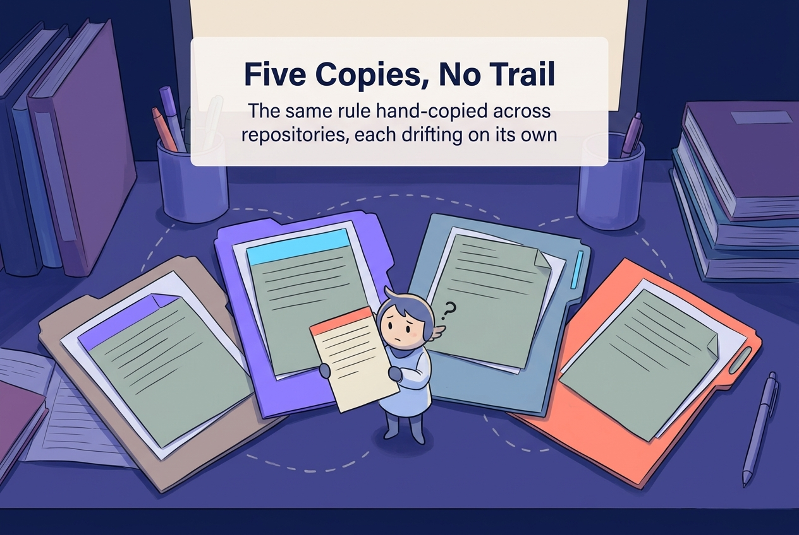
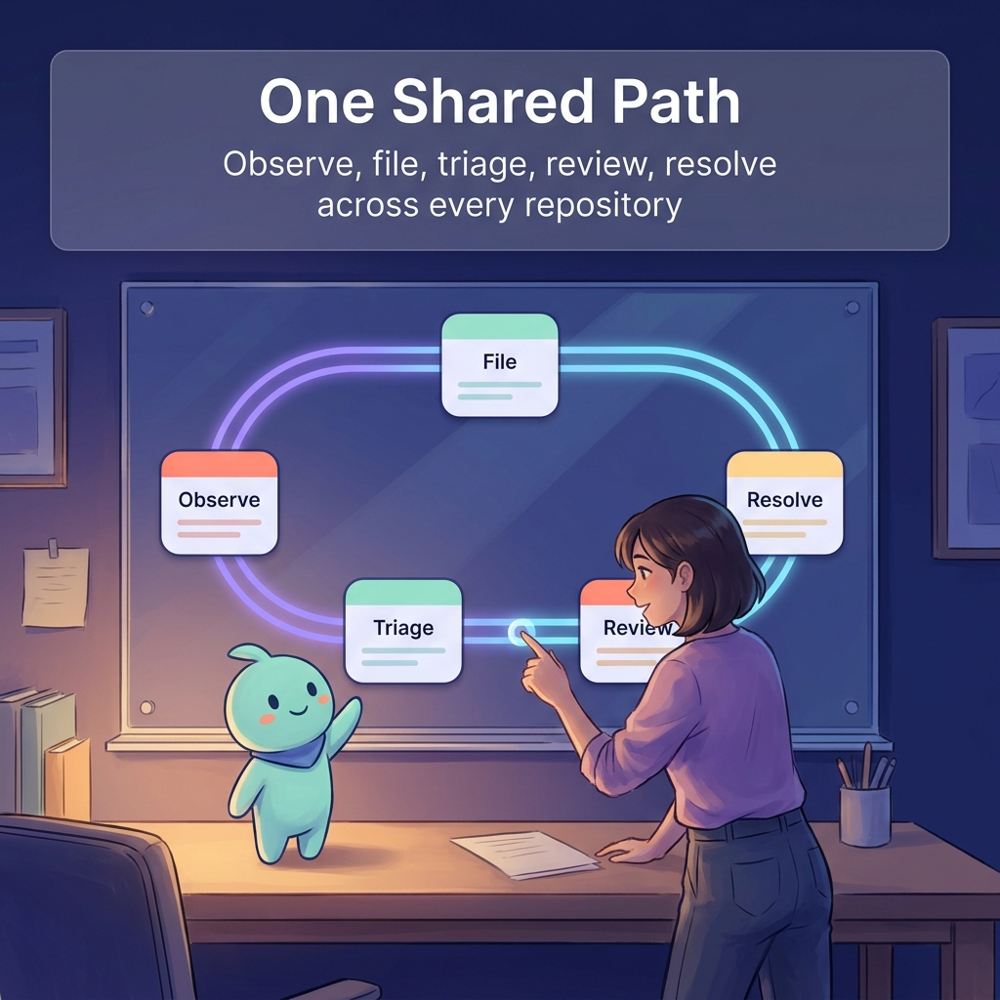

# Observational Issue Ops

> **One repeatable issue log for the whole stack.** A single way to file, stamp, rate, and route a record of something observed or something broken — so a human working through an agent, and an agent acting on its own, write the same shape of record and any repository handles it the same way.

  

A multi-repository project can hold strong evidence and still lose the report. When each repository keeps its own issue form and its own copy of the rules, the same observation gets written down differently in every place, and a reader cannot tell which copy is authoritative.

Observational Issue Ops (OIO) is the one source for that protocol. It packages a versioned ontology, installer, form, and triage workflow for **observational** and **operational** issue logs. A proposal may be recorded for review, but this ontology does not cover general proposals or incident-management records.

## Why this exists

**Copied rules drift.** The same issue form, the same triage, and the same version pins get hand-copied into several repositories. Nothing forces the copies to agree, so they quietly diverge.

  

The copies were also too narrow. They captured only "I saw something", never "something is broken right now" and never "an agent proposes this change" — and they never recorded *who or what filed the issue*, so a human's direct report and an agent's own proposal looked identical on the record. OIO removes the copy and widens the form: the rule lives in one place, and every repository points at it.

## What an issue is here

One canonical form, with a **type** field choosing between two kinds:

| Type | What it records |
| --- | --- |
| **observational** | Something someone saw — a fact, a symptom, a discrepancy — with provenance and citations. |
| **operational** | Something broken or degraded right now: an outage, a failed run, a blocked pipeline. |
| **proposal** and **incident** | Outside this ontology. Use the repository's separately governed proposal or incident process. |

## The filer stamp

Every issue carries a **required filer stamp**, machine-checked by triage. It answers two questions: who initiated the filing, and whose identity is on it.

| Origin | Meaning |
| --- | --- |
| `human-direct` | A human filed the issue themselves. |
| `human-via-agent` | A human directed an agent to file it; the human owns the intent. |
| `agent-proposed` | An agent prepared an issue log for human consideration; it does not grant implementation authority. |
| `agent-initiated` | An agent filed it on its own initiative, without a human asking for this specific issue. |

The stamp records content author, authenticated GitHub actor, session reference when available, destination, and authorization evidence. A body field or prompt stamp is a claim. A mapped human account must separately attest with the matching `oio-auth:` label for a human origin to receive class 1 or 2; shared credentials still cannot prove who typed the prompt.

## What you can make or use

| You want to | OIO gives you | Where it lives |
| --- | --- | --- |
| File anything the same way everywhere | The canonical issue form, with type and filer stamp | `.github/ISSUE_TEMPLATE/observational-issue.yml` |
| Have a filed issue labelled by type, filer class, account tier, project priority, risk review lane, and release relevance | The triage workflow | `.github/workflows/issue-triage.yml` |
| Understand the protocol before filing | The template's own field descriptions | the issue form itself |
| Point another repository at one source | A single repository to reference | this repository |
| Install the prepacked ontology and triage into one selected repository | A safe, pinned installer and project extension scaffold | [docs/ADOPTER_INSTALL.md](docs/ADOPTER_INSTALL.md) |

## How it works

Every record moves along the same short path. The project ontology supplies priority paths 1–100 and namespaced extensions; the risk review lane remains separate from source authority.

  

1. **Observe or hit a problem.** Someone notices something worth recording, or something is broken right now.
2. **File.** The reporter records the issue type, claimed filer origin, destination, ontology versions, project priority path, impact/risk evidence, release relevance, and citations.
3. **Triage.** Automation validates the installed ontology and record schema, then labels the source class, authenticated account tier, project path, impact, release relevance, and advisory review lane. Human-origin claims require a separate account attestation.
4. **Review.** The owner reads the proposal. Every issue is a proposal, not a mandate.
5. **Resolve.** The issue is answered, accepted, or closed, and the trail stays on the issue itself.

## How OIO separates from the rest of the stack

OIO exists separately because the issue log used to live inside the installer. When the install surface owned both the hot-loading and the coordination rules, installing it installed governance — the installer graded itself. OIO takes the governance out. The same reasoning applies to versions: a product repository must not certify its own siblings, so the proposed compatibility manifest lives in its own train repository.

| Repository | Owns | Does not own |
| --- | --- | --- |
| **OIO** (this repository) | The issue-log ticketing system: the form, the filer stamp, the triage, the intake contract, the bootstrap into any repository. | Product code, releases, version pins, narrative, execution continuity, the install surface. |
| **Continuity modules** | Execution continuity: tasks, checkpoints, push receipts, required PR gates. | Issue governance, narrative, versions. |
| **Narrative modules** | Narrative and style authority: writing routing, human-sounding writing, output naming, visual direction, image generation. | Issue governance, execution continuity, versions. |
| **Install surface** | The hot-loader and runtime safety that wires the continuity, narrative, and issue-log modules together. | Issue governance, narrative, execution continuity, versions. |
| **Train repository** | The proposed version manifest for stack compatibility; its current record is not a final certification. | Everything else. |

An adopter pins the train once, consumes OIO's form once, and keeps its own issue history.

## Evidence and boundaries

Each claim below records what the evidence supports and what it leaves open.

| Claim | Status | Evidence | What it does not establish |
| --- | --- | --- | --- |
| The issue form carries an issue type and a required filer stamp, plus required provenance, reproducibility, citations, and priority. | shipped | `.github/ISSUE_TEMPLATE/observational-issue.yml` | That any adopter has switched to consuming it |
| Triage derives type, filer class, account tier, project priority, evidence dimensions, and review lane; it flags missing or mismatched context. | shipped | `.github/workflows/issue-triage.yml` | That labels grant permission to implement or release |
| OIO references the stack-train repository and validates its manifest. | checked | [`stack-manifest.json`](stack-manifest.json) | The live train file is still marked `proposed`; it is not treated here as a final certification |

## Boundaries

- Every issue filed under this protocol is a **non-binding proposal**, not a literal implementation mandate.
- OIO owns the protocol and its triage. It does **not** own any adopter's product code, issues, releases, or version pins.
- Adopters keep their own issue history. Moving a repository onto this source is a separate, owner-gated step.
- The protocol ships a prepacked ontology, a namespaced project extension, a form, a triage step, and an explicit-target installer.

## Try it

The smallest useful next action is to read the form and file one issue against it:

1. Open the issue form at `.github/ISSUE_TEMPLATE/observational-issue.yml`.
2. Read the field descriptions — they are the protocol in short.
3. File an issue only in a repository and for an action authorized by the active task or human direction; inspect type, source, account, priority, evidence, and review-lane labels.

## Related work

- **Plan of record:** [Pukujan/project-continuity-modules#226](https://github.com/Pukujan/project-continuity-modules/issues/226) — the audit, the duplication map, the loose-file inventory, and the target folder tree for every repository in the stack.
